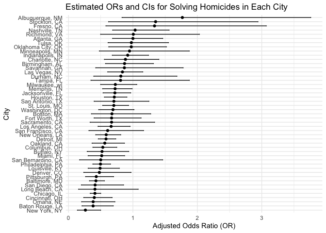

homework 6
================
Xiaoyu Wu
2023-11-18

``` r
library(dplyr)
library(broom)
library(purrr)
library(tidyr)
library(ggplot2)
```

## Problem One

``` r
homicide_data_tidy= read.csv("./data/homicide-data.csv") |> 
# Load the data from a CSV file
  mutate(city_state = paste(city, state, sep = ", ")) |> 
# Create city_state variable
  mutate(is_solved = ifelse(disposition == "Closed by arrest", 1, 0)) |> 
# Create a binary variable indicating whether the homicide is solved
  filter(!city_state %in% c("Dallas, TX", "Phoenix, AZ", "Kansas City, MO", "Tulsa, AL"),
# Omit cities Dallas, TX; Phoenix, AZ; and Kansas City. Also omit Tulsa, AL. 
  victim_race %in% c("White", "Black")) |>
# Limit your analysis those for whom victim_race is white or black
  mutate(victim_age = as.numeric(victim_age))
# Be sure that victim_age is numeric
```

``` r
baltimore_data = homicide_data_tidy|>
  filter(city_state == "Baltimore, MD") |> 
# Filter out the city of Baltimore, MD
  mutate(victim_sex = relevel(as.factor(victim_sex), ref = "Female")) |> 
# Ensure victim_sex is a factor with Female as reference
  mutate(victim_race = factor(victim_race)) 
# Ensure victim_race is a factor 

logistic_model = glm(is_solved ~ victim_age + victim_sex + victim_race, 
                      data = baltimore_data, 
                      family = "binomial")
# Fit logistic regression

odds_ratio_results = broom::tidy(logistic_model, conf.int = FALSE) |> 
  filter(term == "victim_sexMale") |> 
# Comparing male victims to female victims keeping all other variables fixed
  mutate(
    OR = exp(estimate),
    LowerCI = exp(estimate - 1.96 * std.error),
    UpperCI = exp(estimate + 1.96 * std.error)
  )
# Calculate Odds Ratio and its Confidence Interval

odds_ratio_results
```

    ## # A tibble: 1 × 8
    ##   term           estimate std.error statistic  p.value    OR LowerCI UpperCI
    ##   <chr>             <dbl>     <dbl>     <dbl>    <dbl> <dbl>   <dbl>   <dbl>
    ## 1 victim_sexMale   -0.854     0.138     -6.18 6.26e-10 0.426   0.325   0.558

``` r
fit_glm_city = function(city_data) {
  fit_logistic = glm(is_solved ~ victim_age + victim_race + victim_sex, data = city_data, family = binomial())
  tidy_result = fit_logistic|>
    broom::tidy()|>
    filter(term == "victim_sexMale")|>
    mutate(
      OR = exp(estimate),
      LowerCI = exp(estimate - 1.96 * std.error),
      UpperCI = exp(estimate + 1.96 * std.error)
    )|>
    select(term, OR, LowerCI, UpperCI)
}
# Create a function to fit logistic regression for a given city's data

result_list = homicide_data_tidy %>%
  mutate(victim_race = factor(victim_race),
         victim_sex = factor(victim_sex)) %>%
  group_by(city_state) %>%
  nest() %>%
  filter(city_state != "Tulsa, AL") %>%
  mutate(glm_result = map(data, fit_glm_city)) %>%
  unnest(glm_result)
# Applying the function to each city in the dataset
```

``` r
ggplot(result_list, aes(y = OR, x = reorder(city_state, OR))) +
  geom_point() +  
# Points for OR
  geom_errorbar(aes(ymin = LowerCI, ymax = UpperCI), width = 0.2) +  
# Error bars for CIs
  labs(x = "City", y = "Adjusted Odds Ratio (OR)",
       title = "Estimated ORs and CIs for Solving Homicides in Each City") +
  theme_minimal() +
  coord_flip()   
```

<!-- -->

``` r
# Flips the axes to make the cities display horizontally
```

#### Discussion:

Here, we can see that Albuquerque, NM has the highest OR, that is
greatest likelihood of homicide cases being solved. And New York, NY has
the least OR, that is least likelihood of homicide cases being solved.
Also, we can see that higher ORs are accompanied with larger confidence
intervals(longer length of the error bar).

## Problem Two
